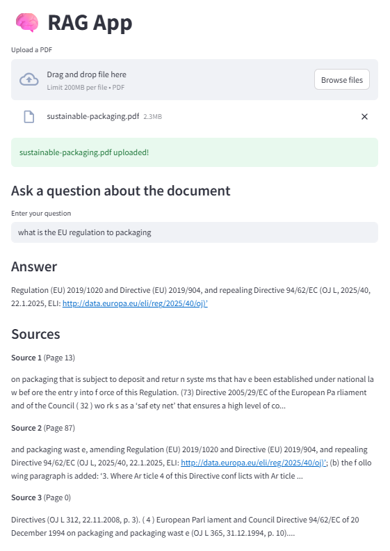

# 🧠 RAG App 

<p align="center">
  
</p>

This is a **Retrieval-Augmented Generation (RAG)** application built using [LangChain](https://github.com/langchain-ai/langchain), [Hugging Face Transformers](https://huggingface.co/docs/transformers/index), and [Streamlit](https://streamlit.io/). It allows you to upload a PDF (e.g., sustainability reports) and ask natural language questions about its contents.

> ✅ Designed for **CPU-only machines** using lightweight models like `google/flan-t5-small`.

---

## 🚀 Features

- Upload any **PDF document**
- Automatically splits text into semantic chunks
- Embeds text using **MiniLM (`all-MiniLM-L6-v2`)**
- Stores vectors in a **FAISS index**
- Uses **Flan-T5** for generating answers (fast & CPU-efficient)
- Built with **Streamlit** for an interactive UI

---

## 📁 Project Structure

```
rag_sustainability/
├── app.py                  # Main Streamlit app
├── data/                   # Uploaded PDFs
├── faiss_index/            # Saved vector index (auto-created)
├── requirements.txt        # Required packages
└── README.md               # You're here
```

---

## 🛠️ Installation

### 1. Clone the repository

```bash
git clone https://github.com/your-username/rag_sustainability.git
cd rag_sustainability
```

### 2. Create virtual environment (optional but recommended)

```bash
python -m venv venv
source venv/bin/activate  # on Windows: venv\Scripts\activate
```

### 3. Install dependencies

```bash
pip install -r requirements.txt
```

---

## ▶️ Run the App

```bash
streamlit run app.py
```

Then open your browser to: [http://localhost:8501](http://localhost:8501)

---

## 📌 Example Workflow

1. Upload a sustainability PDF (e.g., `sustainable-packaging.pdf`)
2. Wait for text chunking, embedding, and vector indexing
3. Ask a question like:
   - *"What are the principles of sustainable packaging?"*
   - *"How does the company reduce plastic usage?"*
4. Get an answer with sources (document page content previews)

---

## 🧠 Technologies Used

- **LangChain** – RAG framework
- **Transformers** – Hugging Face model support
- **FAISS** – Efficient vector similarity search
- **Streamlit** – UI for uploading and interacting
- **Sentence Transformers** – `MiniLM` for embeddings

---

## 💡 Notes

- This app is optimized for **local development without GPU**
- If you do have a GPU, you can swap `flan-t5-small` with `mistralai/Mistral-7B-Instruct-v0.1`
- Only one PDF is handled at a time; multi-document support can be added

---

## 📄 License

MIT License

---

## 🙌 Acknowledgements

- Hugging Face 🤗  
- LangChain Team  
- Sentence Transformers  
- Streamlit
